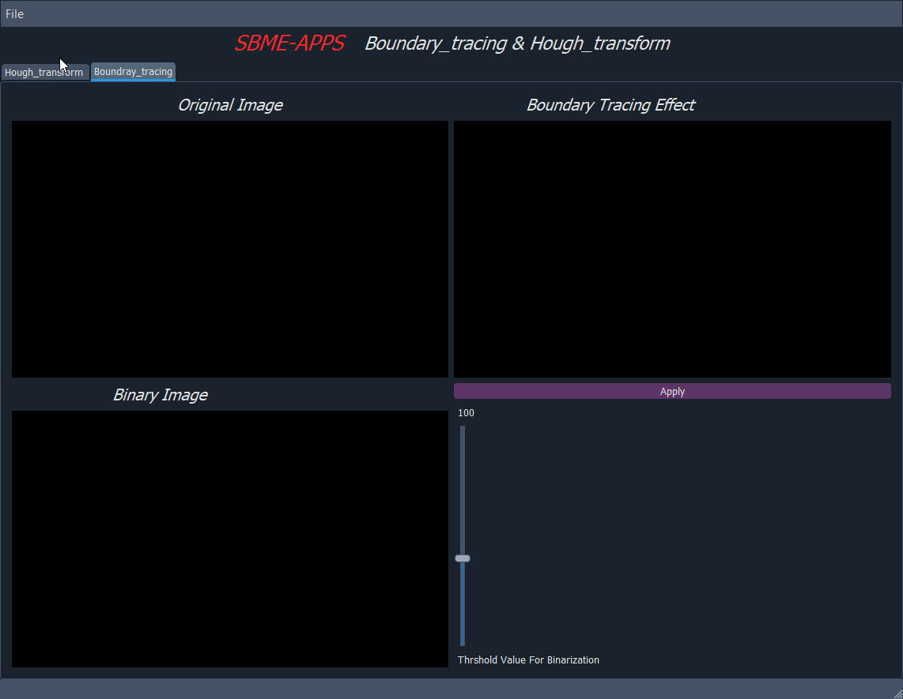

# Boundary tracing & Hough transform
- [Features](#features)
- [Demos](#Demos)
    - [Boundary tracing](#Boundary_tracing)


-[Run-App](#Run-App)  

## Features
- Load images for boundary tracing or for hough transform.
- Binarizing the image and Controlling the thershold of binarization.
- Applying boundary tracing not by a built in function ,but by applying the alogorithm it self. 

------
### Boundary_tracing



---
## Run-App
 **_Run the application_**
```sh
python main.py
```


